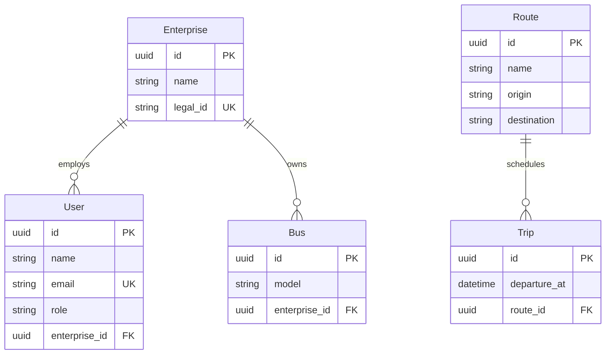

# Bus System

[](https://sonarcloud.io/summary/new_code?id=Agustin-Perezz_bus-system)
[](https://sonarcloud.io/summary/new_code?id=Agustin-Perezz_bus-system)

REST API for a bus transportation system, built with NestJS and Clean
Architecture. Manages enterprises, routes, users, buses, and trips.

## Domain Model



## Architecture

```
src/
├── domain/           # Pure entities (no decorators)
├── application/      # Use cases
├── infrastructure/   # Repositories, MikroORM
└── presentation/     # REST controllers
```

### Key Principles

| Rule | Description |
|------|-------------|
| **Pure Domain** | Entities without framework decorators |
| **Repository per Operation** | One repository per use case, not a fat one |
| **Transactions** | Always use `transactional()` |
| **Direct Imports** | No barrel files |

## Local Setup

### Requirements

- Node.js 20+
- Docker and Docker Compose
- pnpm

### Steps

1. **Clone the repository**
   ```bash
   git clone <repo-url>
   cd bus-system
   ```

2. **Install dependencies**
   ```bash
   pnpm install
   ```

3. **Configure environment variables**
   ```bash
   cp .env.example .env
   # Edit .env with your configuration if needed
   ```

4. **Start PostgreSQL with Docker**
   ```bash
   pnpm docker:up
   pnpm docker:logs
   ```

5. **Build and run the application**
   ```bash
   pnpm start:dev     # Development (hot-reload)
   # or
   pnpm build
   pnpm start:prod
   ```

6. **Verify it works**
   - API: http://localhost:3000
   - Swagger: http://localhost:3000/api

### Docker Commands

```bash
pnpm docker:up      # Start PostgreSQL
pnpm docker:down    # Stop PostgreSQL
pnpm docker:logs    # View logs
```

### Environment Variables

| Variable | Description | Default |
|----------|-------------|---------|
| `DB_HOST` | PostgreSQL host | localhost |
| `DB_PORT` | PostgreSQL port | 5432 |
| `DB_USERNAME` | PostgreSQL user | postgres |
| `DB_PASSWORD` | PostgreSQL password | postgres |
| `DB_NAME` | Database name | books |
| `PORT` | API port | 3000 |
| `NODE_ENV` | Environment (development/production) | development |
| `SENTRY_DSN` | Sentry DSN (only sent in production) | - |
| `SENTRY_TRACES_SAMPLE_RATE` | Sentry tracing sample rate (0.0 to 1.0) | 0.1 |

## Main Commands

```bash
# Development
pnpm start:dev          # Development mode (watch)
pnpm build              # Compile TypeScript
pnpm start:prod         # Production

# Testing
pnpm test               # Unit tests
pnpm test:e2e           # E2E tests

# Linting / Formatting
pnpm lint               # Lint source code
pnpm format             # Format source code
pnpm check              # Lint + format + organize imports

# Docker
pnpm docker:up          # Start PostgreSQL
pnpm docker:down        # Stop PostgreSQL
pnpm docker:logs        # View PostgreSQL logs

# Verification
npx tsc --noEmit        # Type check
pnpm check              # Lint + format + organize imports
```

## Documentation

- [Index](./docs/00_INDEX.md)
- [Architecture](./docs/01_ARCHITECTURE.md)
- [Entities](./docs/02_ENTITIES.md)
- [Use Cases](./docs/03_USE_CASES.md)
- [API](./docs/04_API.md)
- [Testing](./docs/07_TESTING.md)