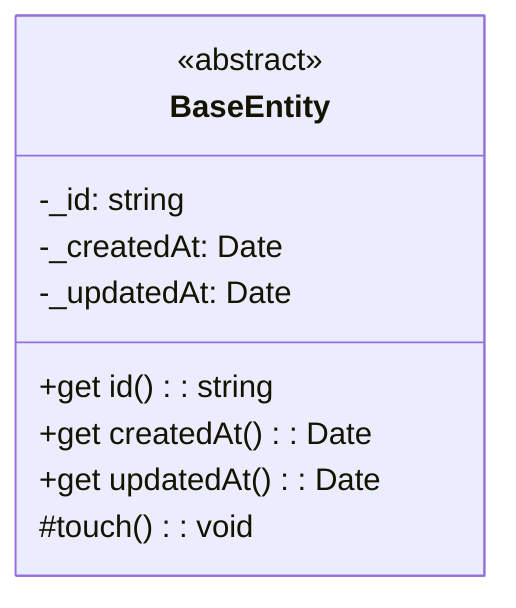
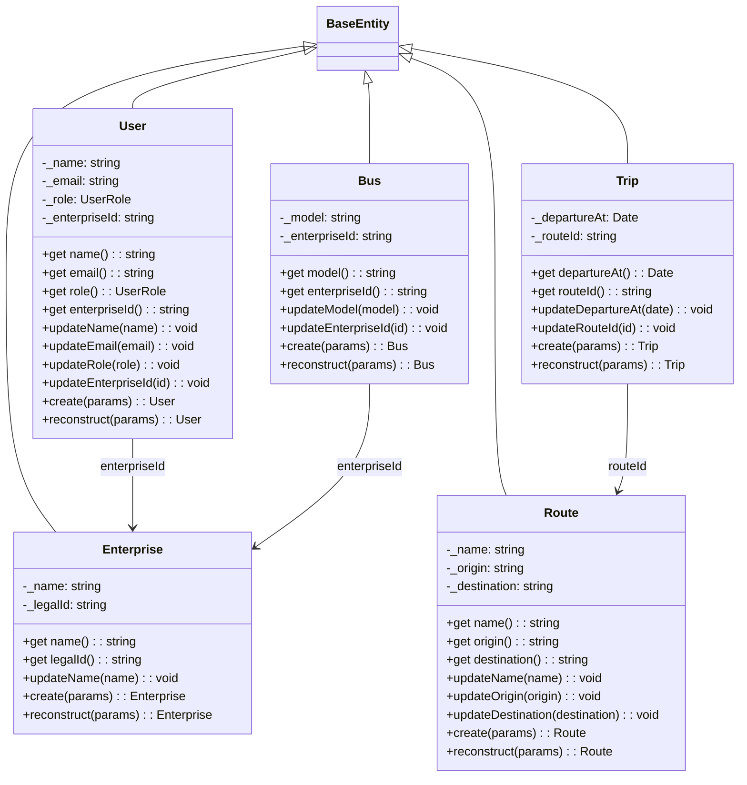

# Domain Entities

## BaseEntity

Abstract base class shared by every domain entity. Holds identity and
timestamp fields; subclasses own their own state and call `touch()` on
mutation.



| Property | Type | Description |
|----------|------|-------------|
| `id` | `string` | UUIDv7, generated in `generateBaseEntityProps()` |
| `createdAt` | `Date` | Creation timestamp (immutable) |
| `updatedAt` | `Date` | Last modification timestamp (advanced by `touch()`) |

`touch()` is `protected` — subclasses call it from their `updateX` methods to
bump `updatedAt`. The domain `BaseEntity` is mirrored by the infra
`BaseEntitySchema` (`defineEntity({ abstract: true })`), which maps the same
fields to columns.

> **Note**: There is no `deletedAt` field. Soft delete is a per-aggregate
> decision, not a cross-cutting concern — adding it to `BaseEntity` would force
> every entity into the same deletion model.

---

## Relationships



Foreign keys are plain `string` IDs in the domain (no typed references).
Infrastructure entities declare ORM relations via `p.manyToOne(X).mapToPk()` —
the relation IS the FK column. See `docs/rules/relations.md`.

---

## Enterprise

| Property | Type | Description |
|----------|------|-------------|
| `id` | `string` | UUIDv7 (inherited) |
| `name` | `string` | Enterprise name |
| `legalId` | `string` | Legal ID (unique, immutable) |
| `createdAt` | `Date` | Creation timestamp (inherited) |
| `updatedAt` | `Date` | Last modification (inherited) |

**Immutable**: `legalId` — set on creation, no update method.

```typescript
const enterprise = Enterprise.create({ name: 'Acme Bus Co.', legalId: 'US-12-3456789' });
enterprise.updateName('Acme Bus Co. Intl.');
```

---

## Route

| Property | Type | Description |
|----------|------|-------------|
| `id` | `string` | UUIDv7 (inherited) |
| `name` | `string` | Route name |
| `origin` | `string` | Origin terminal |
| `destination` | `string` | Destination terminal |
| `createdAt` | `Date` | Creation timestamp (inherited) |
| `updatedAt` | `Date` | Last modification (inherited) |

No FKs — standalone entity.

```typescript
const route = Route.create({ name: 'Central - North', origin: 'Terminal Central', destination: 'Terminal Norte' });
```

---

## User

| Property | Type | Description |
|----------|------|-------------|
| `id` | `string` | UUIDv7 (inherited) |
| `name` | `string` | User name |
| `email` | `string` | Email (unique) |
| `role` | `UserRole` | `'admin' \| 'driver' \| 'user'` |
| `enterpriseId` | `string` | FK → Enterprise |
| `createdAt` | `Date` | Creation timestamp (inherited) |
| `updatedAt` | `Date` | Last modification (inherited) |

`UserRole` is a union type exported from the domain entity. DTOs validate
with `@IsIn(USER_ROLES)`. The MikroORM `UserEntity.role` is typed as
`UserRole` directly — no `as` casts in repositories.

```typescript
const user = User.create({ name: 'Jane Driver', email: 'jane@acme.com', role: 'driver', enterpriseId });
user.updateRole('admin');
```

---

## Bus

| Property | Type | Description |
|----------|------|-------------|
| `id` | `string` | UUIDv7 (inherited) |
| `model` | `string` | Bus model |
| `enterpriseId` | `string` | FK → Enterprise |
| `createdAt` | `Date` | Creation timestamp (inherited) |
| `updatedAt` | `Date` | Last modification (inherited) |

Identified by UUID only — no plate field.

```typescript
const bus = Bus.create({ model: 'Mercedes-Benz O500', enterpriseId });
```

---

## Trip

| Property | Type | Description |
|----------|------|-------------|
| `id` | `string` | UUIDv7 (inherited) |
| `departureAt` | `Date` | Departure timestamp |
| `routeId` | `string` | FK → Route |
| `createdAt` | `Date` | Creation timestamp (inherited) |
| `updatedAt` | `Date` | Last modification (inherited) |

`departureAt` is `Date` in the domain, `timestamptz` in infra, ISO string in
DTOs (`@IsDateString()`). Use cases convert with `new Date(dto.departureAt)`.

```typescript
const trip = Trip.create({ departureAt: new Date('2026-08-10T08:00:00Z'), routeId });
```

---

## Factory Methods

Every entity has two factory methods — never use `new` outside the class:

- **`create(props)`** — generates UUIDv7 + timestamps via `generateBaseEntityProps()`
- **`reconstruct(props)`** — restores from persisted data, takes `id`, `createdAt`, `updatedAt` as part of props

Repository interfaces live next to each use case under
`src/application/use-cases/{domain}/{action}-{entity}/` and follow the
one-repository-per-operation pattern documented in `AGENTS.md`.